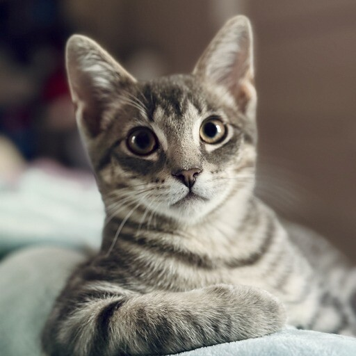
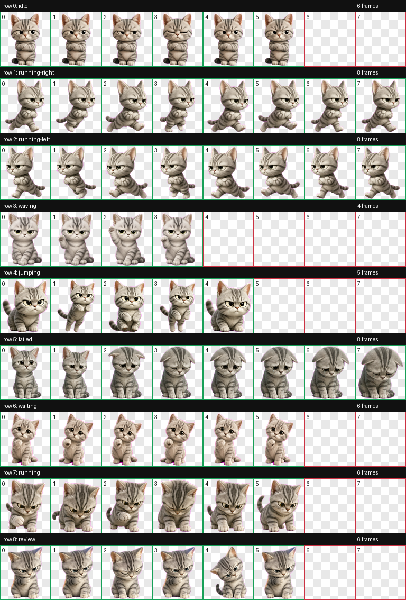
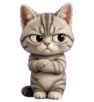
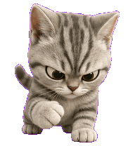
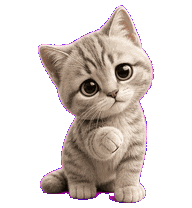
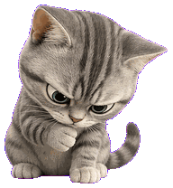

# Larry David Desktop Pet

A tiny animated desktop pet package based on Larry David, my deeply unimpressed silver tabby.

This repo contains the finished spritesheet, animation previews, contact sheet, and a small validation script for installing Larry into a local desktop pet app.

~~Not _that_ Larry David.~~ The real Larry David here is the cat in my GitHub profile photo, and he is the ~~model~~ reference for this design.



## Preview



Individual state previews:

| Idle | Running | Waiting | Review |
| --- | --- | --- | --- |
|  |  |  |  |

## Contents

- `pet/pet.json` - local pet manifest
- `pet/spritesheet.webp` - final 8x9 spritesheet
- `qa/contact-sheet.png` - contact sheet for all animation states
- `qa/previews/*.gif` - per-state animation previews
- `scripts/install-local.sh` - local installer
- `scripts/validate-package.py` - package sanity check

## Install Locally

Run:

```bash
export LOCAL_PET_APP_HOME="/path/to/your/local/pet/app"
./scripts/install-local.sh
```

That copies the pet into the target pet folder.

To make Larry active, set:

```toml
selected-avatar-id = "custom:larry-david-v3"
```

in your local app config, then wake or restart the app if needed.

## Notes

This is just a tiny polished package for a local desktop companion. The repo intentionally includes only the finished pet package and preview artifacts.
